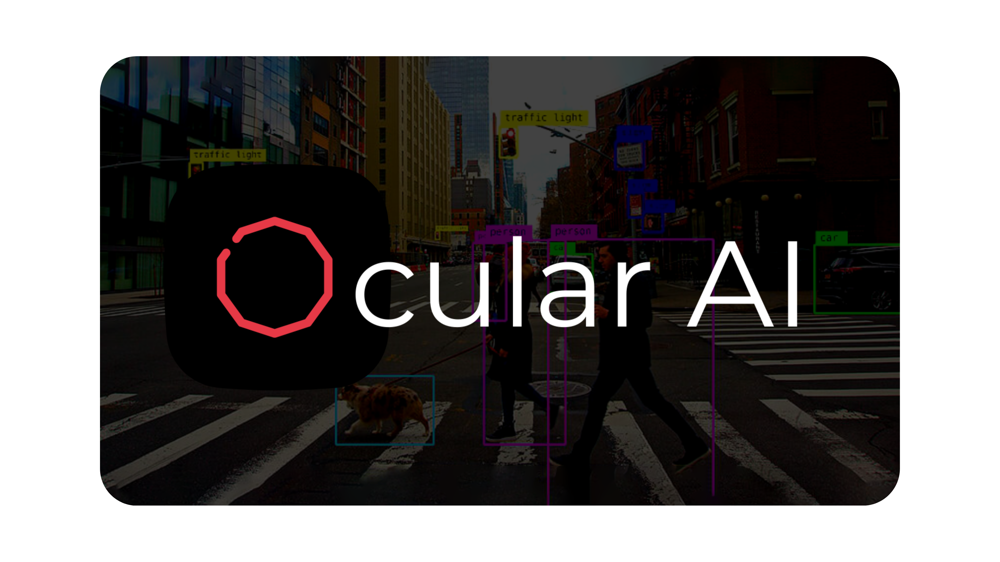
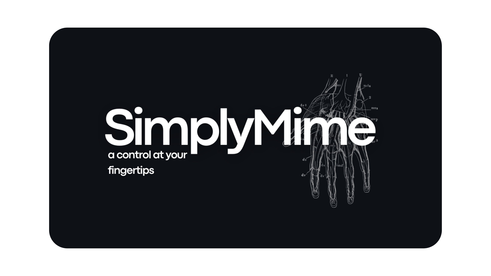
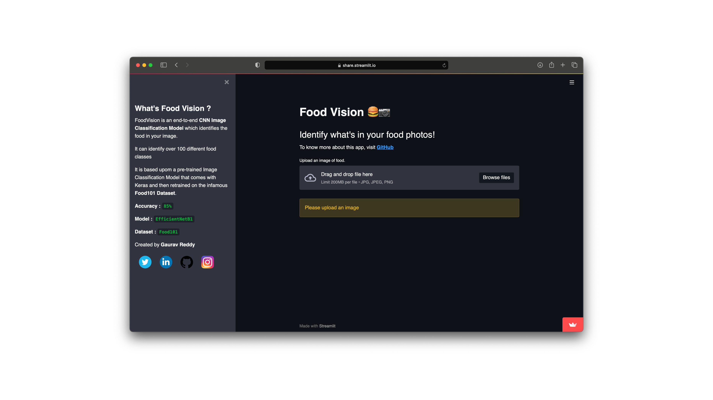
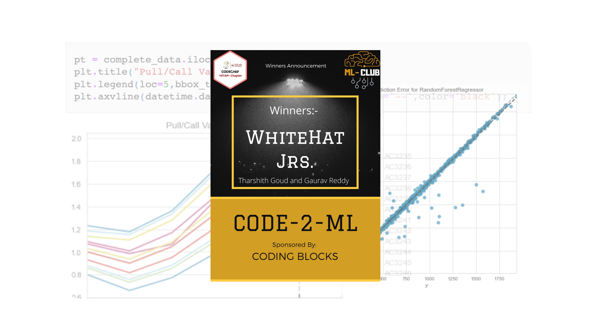

<h1 align="center">Hi , I'm Gaurav Reddy</h1> 

-  Check out my recent work on [**OcularAI : Redefining the Sense of Sight**](https://github.com/gauravreddy08/ocularai)
-  I’m currently working on [**SimplyMime**](https://github.com/gauravreddy08/SimplyMime)
-  I’m currently playing around with **`GANs and Style Transfer`**  
-  I’m looking to collaborate on anything related **`Artificial Intelligence`**  
-  Reach me out by [**gauravreddy008@gmail.com**](mailto:gauravreddy008@gmail.com)
